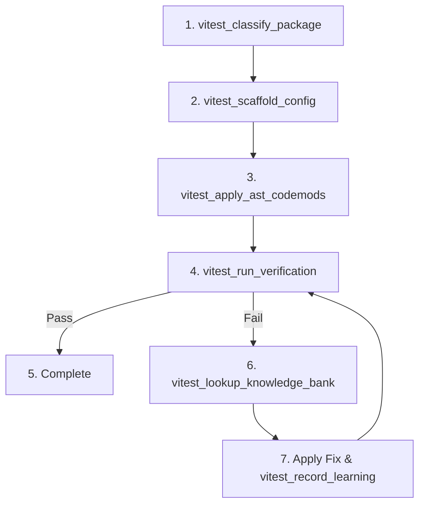

# Vitest Migrator MCP (`vitest-migrator-mcp`)

A Model Context Protocol (MCP) Server that provides automated AST codemods, multi-project test runner scaffolding, and self-learning diagnostic tools for migrating JavaScript/TypeScript packages from legacy test runners (Karma, Webpack, Mocha) to **Vitest** (Node and Playwright Chromium browser testing).

---

## Prerequisites

* **Node.js**: `>= 18.0.0` (Node 20 or Node 22 recommended)
* **Package Manager**: `npm`, `yarn`, or `pnpm`
* **Supported OS**: Linux, macOS, Windows (WSL / Native)

---

## Installation & Setup

### 1. Clone and Build Locally

```bash
# Clone the repository
git clone https://github.com/Manvi1203/vitest-migrator-mcp.git
cd vitest-migrator-mcp

# Install dependencies
npm install

# Build TypeScript to dist/
npm run build
```

This generates the executable entry point at `dist/index.js`.

---

## Connecting to MCP Clients

The server communicates via standard I/O (`stdio`). You can register it in any MCP-compatible AI assistant or editor.

### A. Claude Desktop

Add the server to your `claude_desktop_config.json`:

* **macOS**: `~/Library/Application Support/Claude/claude_desktop_config.json`
* **Windows**: `%APPDATA%\Claude\claude_desktop_config.json`
* **Linux**: `~/.config/Claude/claude_desktop_config.json`

```json
{
  "mcpServers": {
    "vitest-migrator": {
      "command": "node",
      "args": ["/ABSOLUTE/PATH/TO/vitest-migrator-mcp/dist/index.js"]
    }
  }
}
```

---

### B. Cursor / VS Code (Cline / Roo Code / MCP Extension)

Add to your MCP configuration file (`mcp.json` or Extension settings):

```json
{
  "mcpServers": {
    "vitest-migrator": {
      "command": "node",
      "args": ["/ABSOLUTE/PATH/TO/vitest-migrator-mcp/dist/index.js"]
    }
  }
}
```

---

### C. Gemini CLI / Jetski / Antigravity

Add to your workspace or global `mcp_config.json`:

```json
{
  "mcpServers": {
    "vitest-migrator": {
      "command": "node",
      "args": ["/ABSOLUTE/PATH/TO/vitest-migrator-mcp/dist/index.js"]
    }
  }
}
```

---

## Exposed MCP Tools Reference

The server exposes 7 specialized tools designed for test suite analysis, transformation, and verification:

| Tool | Parameters | Description |
|---|---|---|
| `vitest_classify_package` | `packagePath: string` | Inspects `package.json`, test directories, and karma configs to classify the package tier (`tier1`: standard unit, `tier2`: emulator/integration, `tier3`: complex multi-target/platform aliased). |
| `vitest_scaffold_config` | `packagePath: string`, `tier?: string` | Scaffolds unified `vitest.config.mjs` (Node + Chromium projects), `src/types/vitest-globals.d.ts`, and `test/setup.ts`, and updates `package.json` test scripts with Playwright guards. |
| `vitest_apply_ast_codemods` | `packagePath: string` | Executes deterministic AST transformations (`ts-morph`) to fix type-only re-exports (`export type`), chained Mocha `.timeout(ms)`, `this.test.fullTitle()`, and CommonJS `require()` imports. |
| `vitest_run_verification` | `packagePath: string`, `target: "vitest-browser" \| "vitest-node" \| "mocha-node"` | Executes the test suite in headless mode and parses test execution outputs into structured JSON pass/fail diagnostics. |
| `vitest_lookup_knowledge_bank` | `errorMessage: string` | Matches runtime errors against indexed error signatures and returns root cause explanations and recommended code transforms. |
| `vitest_record_learning` | `errorPattern: string`, `rule: string`, `rootCause: string`, `fixStrategy: "AST_TRANSFORM" \| "AI_PROMPT"` | Dynamically adds newly discovered error patterns and resolution strategies to `data/knowledge-bank.json`. |
| `vitest_list_knowledge_rules` | *(none)* | Returns all active rules and diagnostic patterns stored in the knowledge base. |

---

## Step-by-Step Package Migration Workflow

When migrating a package with an AI agent or automated script, follow this structured pipeline:



### 1. Classify the Package
Inspect complexity, target runtime, and emulator dependencies:
```json
{
  "name": "vitest_classify_package",
  "arguments": {
    "packagePath": "/path/to/my-monorepo/packages/auth"
  }
}
```

### 2. Scaffold Configs & Dependencies
Generate multi-project configurations and package scripts:
```json
{
  "name": "vitest_scaffold_config",
  "arguments": {
    "packagePath": "/path/to/my-monorepo/packages/auth",
    "tier": "tier3"
  }
}
```

### 3. Run Deterministic AST Codemods
Automatically rewrite syntax that differs between Karma/Webpack and Vitest ESM:
```json
{
  "name": "vitest_apply_ast_codemods",
  "arguments": {
    "packagePath": "/path/to/my-monorepo/packages/auth"
  }
}
```

### 4. Execute Verification Loop
Run browser and Node unit tests headlessly:
```json
{
  "name": "vitest_run_verification",
  "arguments": {
    "packagePath": "/path/to/my-monorepo/packages/auth",
    "target": "vitest-browser"
  }
}
```

### 5. Diagnose & Record Fixes
If a test failure occurs, query the Knowledge Bank or save the solution:
```json
{
  "name": "vitest_lookup_knowledge_bank",
  "arguments": {
    "errorMessage": "TypeError: Cannot redefine property: getAuth"
  }
}
```

---

## Architecture & File Layout

```
vitest-migrator-mcp/
├── data/
│   └── knowledge-bank.json      # Persistent error signatures and fix rules
├── src/
│   ├── index.ts                 # MCP Server entrypoint (stdio protocol handler)
│   ├── templates/               # Boilerplate templates injected during scaffolding
│   │   ├── setup.ts.tpl         # Browser test setup (Chai, Sinon, Mocha aliases)
│   │   ├── setup.node.ts.tpl    # Node test setup
│   │   ├── vitest.config.mjs.tpl# Multi-project runner config
│   │   └── vitest-globals.d.ts.tpl # Ambient typing definitions
│   └── tools/
│       ├── classifier.ts        # Package analysis logic
│       ├── scaffolder.ts        # Config & package.json injector
│       ├── codemods.ts          # ts-morph AST transformations
│       ├── runner.ts            # Test execution and stdout parser
│       └── knowledgeBank.ts     # Diagnostic knowledge lookup and rule persistence
├── package.json
└── tsconfig.json
```

---

## Development & Maintenance

### Build from Source
```bash
npm run build
```

### Watch Mode
```bash
npm run watch
```

### Test Stdio Directly
You can run the server directly in terminal to verify startup:
```bash
node dist/index.js
```

---

## License

Apache-2.0
